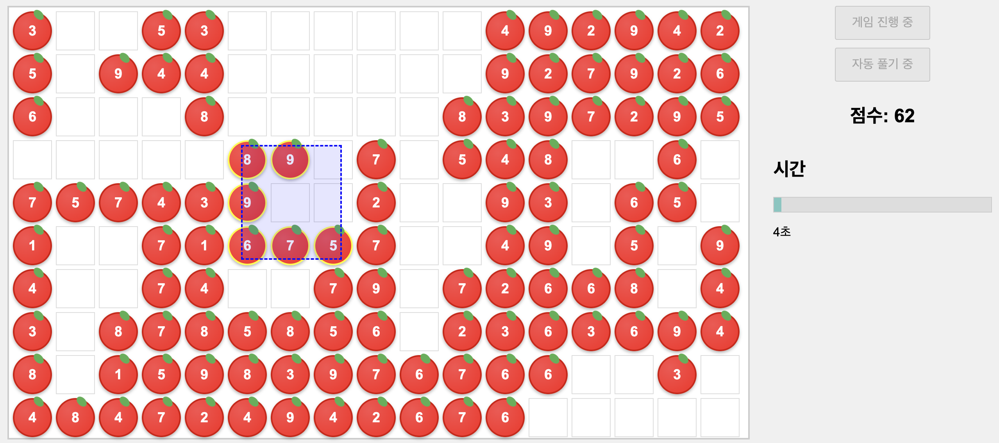

# Fruit Box Clone / 사과게임



## Overview / 게임 개요

Fruit Box is a simple and addictive puzzle game where players drag a selection box across a grid of apples. Each apple displays a number from 1 to 9. The objective is to select apple combinations whose sum equals 10 within a two-minute time limit, earning 1 point per apple in a valid combination. Originally inspired by the flash game "フルーツボックス".

사과게임은 17×10 격자에 배치된 1부터 9까지 숫자가 적힌 사과들을 드래그하여 선택하고, 선택된 사과들의 합이 10이 될 경우 제거되어 점수를 획득하는 간단하면서도 중독성 있는 퍼즐 게임입니다. 2분의 제한 시간 내에 최대한 많은 점수를 모으는 것이 목표입니다. 원본 게임은 일본의 플래시 게임 "フルーツボックス"를 기반으로 만들어졌습니다.

## Gameplay / 게임 방식

- At the start of the game, a grid of apples arranged in 17 columns and 10 rows is displayed, with each apple showing a number between 1 and 9.
- Players drag a selection box across the grid to choose a group of apples.
- If the sum of the selected apples equals 10, the selection box turns red. When the drag ends, the selected apples are removed, awarding 1 point per apple.
- Typically, valid combinations consist of two apples, although in some cases three or four apples can also be selected.

- 게임 시작 시 17×10 격자에 1부터 9까지 숫자가 적힌 사과들이 나타납니다.
- 화면을 드래그하면 선택 박스가 생성되고, 박스 안의 사과들을 선택할 수 있습니다.
- 선택한 사과들의 합이 10이 되면 선택 박스가 빨간색으로 변하며, 드래그를 마치는 순간 해당 사과들이 제거되어 사과 하나 당 1점씩 획득합니다.
- 대부분 두 개의 사과 조합으로 플레이하지만, 경우에 따라 세 개 또는 네 개의 조합도 가능합니다.

## Original Game / 원본게임

Original Game: フルーツボックス
This clone draws its inspiration from the original flash game "[フルーツボックス](https://www.gamesaien.com/game/fruit_box_a/)" available on the Japanese flash game portal "게임채원(ゲーム菜園)". With the discontinuation of Flash support, the game was reimplemented using HTML5 Canvas.

원본게임: フルーツボックス
이 클론은 일본의 플래시 게임 모음 사이트인 "게임채원(ゲーム菜園)"에 있던 플래시 게임 "[フルーツボックス](https://www.gamesaien.com/game/fruit_box_a/)"를 기반으로 만들어졌습니다. 플래시 지원 종료 이후 HTML5 Canvas로 새롭게 구현되었습니다.

## Technologies and Features / 기술 및 기능

- Built with HTML, CSS, and JavaScript.
- Implements drag selection, a scoring system, a countdown timer, and an auto-solve feature that highlights valid apple combinations.
- The grid is dynamically generated with random numbers between 1 and 9.

- HTML, CSS, JavaScript로 제작됨.
- 드래그 선택, 점수 시스템, 카운트다운 타이머, 유효한 사과 조합을 하이라이트하는 자동 풀이 기능 등을 포함함.
- 1부터 9까지의 숫자가 랜덤으로 배치된 격자가 동적으로 생성됩니다.

## How to Run / 실행 방법

1. Clone the repository.
```
git clone https://github.com/kairess/fruit-box-clone.git
```

2. Run the game.
```
cd fruit-box-clone
npm install
npm run dev
```

## Created by / 제작자

YouTube [빵형의 개발도상국](https://www.youtube.com/@bbanghyong)
